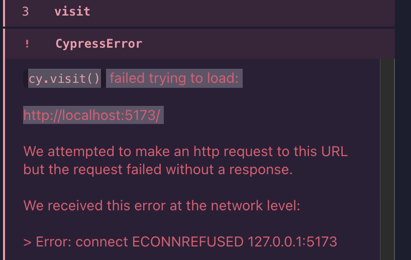

# cypress

---

This repository provides a step-by-step guide on how to set up Cypress for testing your project.

---

## Installation

1. To install Cypress, run this command  
    `npm install --save-dev cypress`

2. Define npm script for running test in package.json

    ```javascript
        "scripts": {
        "cypress:open": "cypress open", // run tests in the graphical test mode
        "test:e2e": "cypress run" // run tests from the command line
        }
    ```

---

## Configuration

1. Add an npm script for the backend of the project. This will enable the backend to be started in test mode

    In the backend's package.json,

    ```javascript
        "scripts": {
        ...
        "start:test": "NODE_ENV=test node index.js"
        }
    ```
---

## Usage

1. To start Cypress, run this command  
    `npm run cypress:open`

2. When Cypress is opened,  
   1) Select `E2E Testing`  
   2) Select `Chrome` broswer  
   3) Select `Create a new spec`  
   4) Enter this path for your new spec `cypress/e2e/{yourprojectname}.cy.js`  

3. To run tests from the command line, run this command  
    `npm run test:e2e`

---

## Handling errors

- If you see the Eslint error in your file,  
1. Install eslint-plugin-cypress  
    `npm install eslint-plugin-cypress --save-dev`  
2. Change the config in .eslintrc.cjs  
    add `"cypress/globals": true` into `"env"` section  
    add `"react", "jest", "cypress"` into `"plugin"` section  

- If you see the CypressError like the screenshot below,  

1. Fix `npm run dev` script in the package.json in the frontend folder.  
    ```javascript
    "dev": "vite --host"
    ```
2. Start the frontend server again  
   `npm run dev`  
3. Start Cypress again  
   `npm run cypress:open`